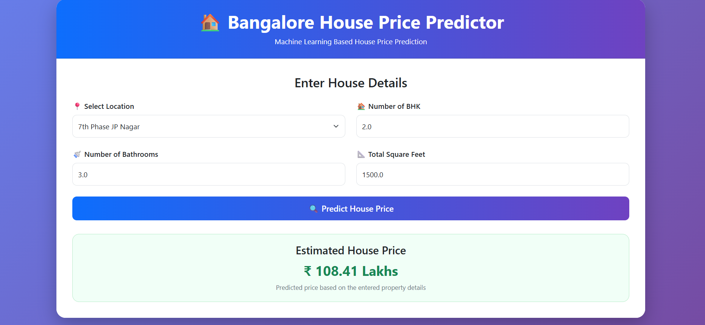

# 🏠 Bangalore House Price Predictor

An end-to-end Machine Learning web application that predicts house prices in Bangalore based on property details such as location, BHK, number of bathrooms, and total square feet.

The machine learning model is integrated with a Flask web application and provides house price predictions through an interactive user interface.

## 🚀 Features

- Predict Bangalore house prices
- Location-based prediction
- User inputs for BHK, bathrooms, and total square feet
- Data cleaning and preprocessing
- Outlier detection and removal
- Categorical feature encoding
- Machine Learning regression models
- Interactive Flask web application
- Responsive Bootstrap-based user interface

  ## 🌐 Live Demo

🚀 **[Click Here to Open the House Price Predictor](https://bangalore-house-price-predictor-kghi.onrender.com)**

> **Note:** Hosted on Render's free tier. The first request after inactivity may take around 50 seconds.


## 📸 Project Screenshot

Below is the user interface of the Bangalore House Price Predictor:



## 🤖 Machine Learning Models

The following regression algorithms were tested:

- Linear Regression
- Lasso Regression
- Ridge Regression

The final application uses the trained **Ridge Regression** model.

## 🛠️ Technologies Used

### Machine Learning
- Python
- Pandas
- NumPy
- Scikit-learn

### Backend
- Flask

### Frontend
- HTML
- CSS
- Bootstrap

### Development Tools
- Jupyter Notebook
- VS Code

## 📊 Machine Learning Workflow

The project follows the following workflow:

1. Data Collection
2. Data Cleaning
3. Handling Missing Values
4. Feature Engineering
5. Outlier Detection and Removal
6. Categorical Data Encoding
7. Train-Test Split
8. Model Training
9. Model Evaluation
10. Model Selection
11. Model Serialization using Pickle
12. Flask Integration
13. Web Interface Development

## 📥 Input Features

The model predicts house prices using:

- Location
- Number of BHK
- Number of Bathrooms
- Total Square Feet

## 📤 Output

The application predicts the estimated house price in **Lakhs (₹)**.

Example:

Input:

Location: 1st Block Jayanagar  
BHK: 3  
Bathrooms: 2  
Total Square Feet: 1500

Output:

Estimated House Price: ₹108.41 Lakhs

## 📁 Project Structure

```text
HousePricePredictor/
│
├── templates/
│   └── index.html
│
├── Cleaned_data.csv
├── RidgeModel.pkl
├── main.py
├── requirements.txt
└── README.md
